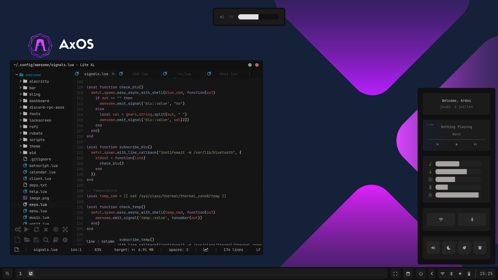

# AwesomeWM-dots
Computer nuke but still cool

>[!IMPORTANT]
>Code for public reference only, use it at your own risks

Dependencies are in `deps.txt` file and required fonts are in `fonts` directory.



Clone this repo to `.config/awesome` and copy `alacritty` folder in your .config directory:
```sh
git clone https://github.com/levraiardox/AwesomeWM-dots.git $HOME/.config/awesome && cd $HOME/.config/awesome
cp -r alacritty ~/.config/
```

You can copy the fonts into `/usr/share/fonts/TTF/` (recommended) or in `.fonts/`.